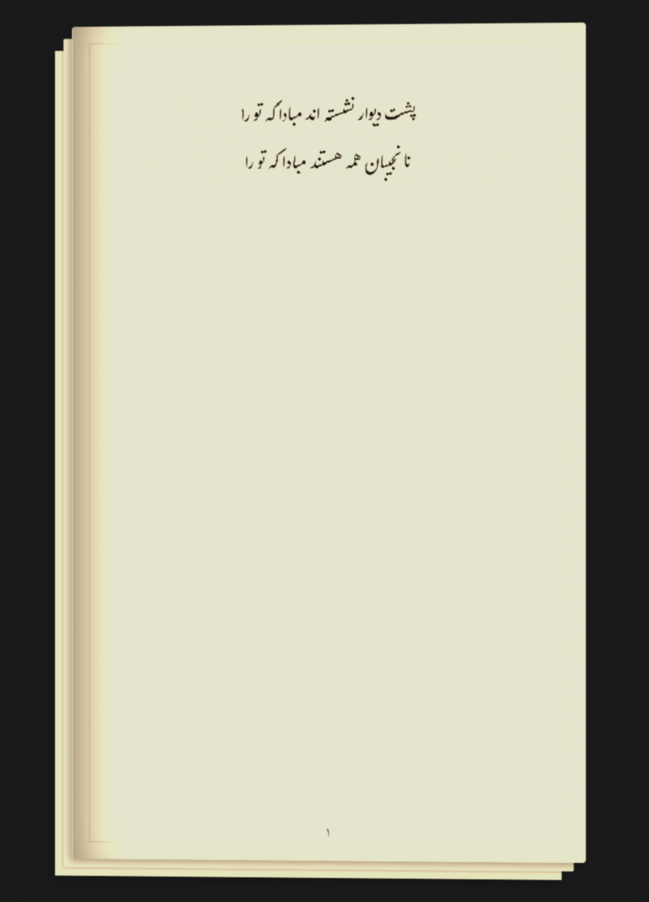

# Vintage Persian Writing Interface (قلمدان)

A sophisticated, distraction-free writing environment designed specifically for Persian literature. This text editor mimics the aesthetic of vintage manuscripts and books, featuring real-time pagination, atmospheric effects, and smart Persian typing assistance.



## ✨ Key Features

### 📖 Authentic Book Experience
- **Real-time Pagination**: Text automatically flows into new pages as you type, just like a real book. No scrolling—flip through pages naturally.
- **Two-Page View**: View two pages side-by-side or switch to single-page focus mode.
- **Grid View**: See an overview of all pages and organize your manuscript.

### ✍️ Optimized for Persian
- **Smart Formatting**: Automatically handles Zero-Width Non-Joiners (Nim-faseleh) for prefixes/suffixes (e.g., converts "mi ravi" to "می‌روی").
- **Typography Styles**: Preset styles for **Poetry** (center-aligned blocks) and **Dialogue**.
- **Font Support**: Pre-configured with beautiful vintage Persian fonts.

### 🕯️ Atmosphere & Immersion
- **Candle Mode**: A dynamic lighting effect that follows your cursor/caret, simulating writing by candlelight.
- **Ink Mode**: Adds subtle imperfections and texture to the text to mimic ink on paper.
- **Paper Customization**: Choose from various paper textures and colors, or create your own custom tints.

### 🛠️ Powerful Tools
- **Auto-Save**: Your work is saved locally in real-time. Never lose a word.
- **Image Support**: Drag and drop images directly onto pages. They get framed in a vintage style, can be rotated, and support captions.
- **Undo System**: Custom undo/redo history that supports text and image operations (Ctrl+Z).
- **Export**: optimized CSS for printing to PDF (`Ctrl+P`) without UI elements.
- **Raw Editor**: A distraction-free plain text mode for bulk editing.

## 🚀 Getting Started

### Prerequisites
No installation required. This is a client-side web application built with Vanilla JavaScript.

### Running the App
1. **Download** the repository.
2. **Double-click** `start-server.bat` (Windows) to launch the local server.
   - *Alternative*: Open `index.html` directly in your browser (some features like image loading might be restricted by browser security policies if not run on a server).
3. Start writing!

## ⌨️ Keyboard Shortcuts

| Shortcut | Action |
|----------|--------|
| `Alt + V` | Toggle Single/Double Page View |
| `Alt + I` | Toggle Ink Mode |
| `Alt + C` | Toggle Candle Mode |
| `Alt + P` | Upload/Insert Image |
| `Alt + R` | Open Raw Text Editor |
| `Alt + Q` | Toggle Low Quality (Performance Mode) |
| `Ctrl + Z` | Undo |
| `Arrow Left/Right` | Navigate Pages |

### Contextual Formatting
Select text and press:
- `1`: Bold
- `2`: Dialogue Style
- `3`: Poetry Style

## 📂 Project Structure

```
vintage-persian-writing-interface/
├── app.js             # Core logic (Pagination, Events, State)
├── style.css          # Styling & Animations
├── index.html         # Main entry point
├── start-server.bat   # Simple launcher
└── fonts/             # Font files
```

## 🤝 Contributing
Feel free to submit issues or pull requests. Major changes to the pagination logic should be tested against `single-child` checks to prevent infinite loops.

---

<div dir="rtl">

# واسط نوشتار فارسی قدیمی (قلمدان)

یک محیط نوشتاری زیبا و بدون حواس‌پرتی که مخصوص ادبیات فارسی طراحی شده است. این ویرایشگر حس و حال نوشتن در کتاب‌ها و نسخ خطی قدیمی را شبیه‌سازی می‌کند.

## ویژگی‌ها:
- **صفحه‌بندی زنده:** متن هنگام تایپ به صورت خودکار به صفحه بعد می‌رود.
- **تایپ هوشمند:** اصلاح خودکار نیم‌فاصله‌ها (مثلاً تبدیل «می روم» به «می‌روم»).
- **حالت شمع و جوهر:** افکت‌های نوری و بصری برای ایجاد فضایی نوستالژیک.
- **ذخیره خودکار:** همه چیز در مرورگر شما ذخیره می‌شود.
- **پشتیبانی از عکس:** کشیدن و رها کردن عکس‌ها، همراه با قاب‌های قدیمی.
- **خروجی PDF:** پرینت تمیز و بدون مزاحمت‌های بصری.

</div>

